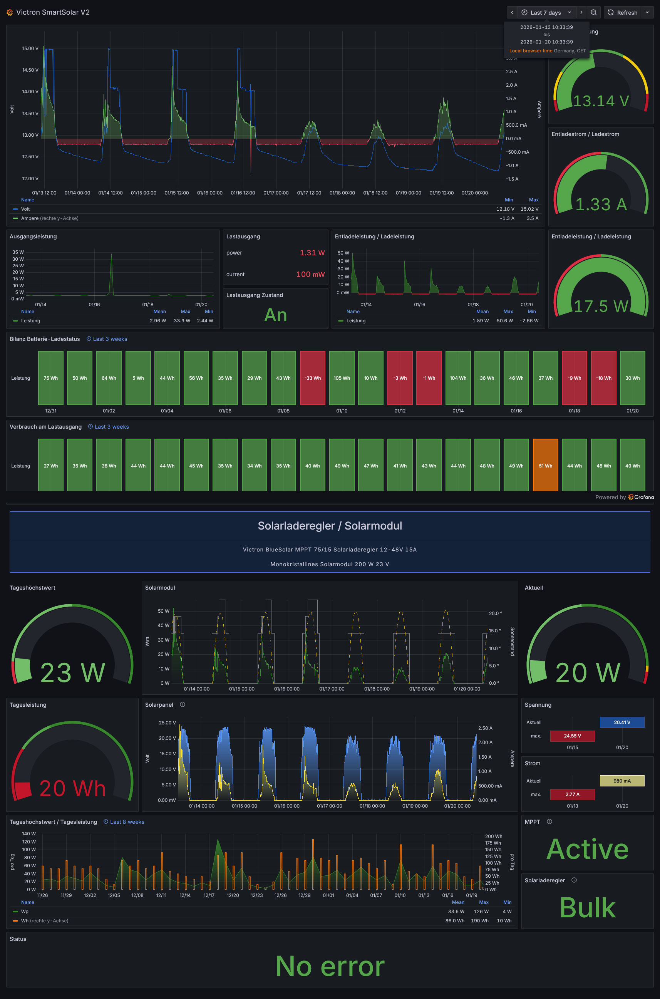

# Victron SmartSolar Monitoring System

## Overview

InfluxDB/Grafana monitoring system for Victron SmartSolar MPPT charge controller with automated three-tier downsampling for efficient long-term data retention.



**Features:**

- Peak-preserving power aggregation (`max`)
- Dynamic bucket selection based on query time range
- Two-year 5-minute resolution, infinite 1-hour resolution
- Automated backfill tools for historical data
- Optimized downsample pipeline (43% reduction vs. original)

---

## Architecture

### Bucket Strategy

| Bucket       | Retention | Resolution | Query Range  | Purpose                   |
| ------------ | --------- | ---------- | ------------ | ------------------------- |
| `victron`    | 180 days  | 1-5s       | ≤72h         | Live monitoring, raw data |
| `victron_5m` | 730 days  | 5 minutes  | 72h-720h     | Medium-term (2 years)     |
| `victron_1h` | Infinite  | 1 hour     | >720h (30d+) | Long-term history         |

**Dashboard Logic:** Queries automatically select the appropriate bucket based on time range for optimal performance.

### Data Fields

**Raw (`victron`):** `power`, `voltage`, `current`, `yield`, `status`, `CS_Status`, `ERR_Status`, `MPPT_Status`

**Downsampled (`victron_5m`, `victron_1h`):** `power_last`, `power_max`, `voltage_last`, `current_last`, `yield_last`, `*_Status_last`

### Downsample Pipeline

### Downsample Pipeline

**Stage 1:** `victron → victron_5m` (every 5 minutes)

- `power/voltage/current` → `power_last/voltage_last/current_last` (last value)
- `ve_direct_today.yield` → `yield_last` (daily counter)
- `ve_direct_today.power` → `power_max` (peak preservation)
- Status fields → `*_Status_last`

**Stage 2:** `victron_5m → victron_1h` (every hour)

- All `_last` fields → re-aggregated with `fn: last`
- `power_max` → re-aggregated with `fn: max` (preserves peaks across cascade)

---

## File Structure

```
deployment/
  ├── victron_downsample_5m.flux    # Stage 1 downsample task (5min)
  ├── victron_downsample_1h.flux    # Stage 2 downsample task (1h)
  └── victron_dashboard.json        # Grafana dashboard

backfill/
  ├── README.md                     # Detailed backfill guide
  ├── backfill_5m_monthly.flux      # Backfill Stage 1 (parameterized)
  ├── backfill_1h_monthly.flux      # Backfill Stage 2 (parameterized)
  └── backfill_history.sh           # Automated monthly backfill script
```

---

## Deployment

### 1. Create Buckets

```bash
influx bucket create -n victron -r 4320h -o wolke      # 180 days (6 months)
influx bucket create -n victron_5m -r 17520h -o wolke  # 730 days (2 years)
influx bucket create -n victron_1h -r 0 -o wolke       # infinite retention
```

### 2. Deploy Downsample Tasks

```bash
influx task create -f deployment/victron_downsample_5m.flux -o wolke
influx task create -f deployment/victron_downsample_1h.flux -o wolke
```

### 3. Run Backfill (Choose One Method)

**Option A: Last N days (simple)**

```bash
# Edit backfill/backfill_5m_monthly.flux
# Set: timeRange = duration(v: 60d)
# Execute in InfluxDB Data Explorer

# Edit backfill/backfill_1h_monthly.flux
# Set: timeRange = duration(v: 60d)  ← same duration!
# Execute in InfluxDB Data Explorer
```

**Option B: Full history (automated)**

```bash
cd backfill/
./backfill_history.sh 2024-01-01 12  # start date, number of months
```

**Option C: Custom date range**

```bash
# Edit both backfill scripts
# Set: start_ts = 2024-01-01T00:00:00Z
#      stop_ts = 2024-02-01T00:00:00Z
# Execute both in InfluxDB Data Explorer
```

See [backfill/README.md](backfill/README.md) for detailed instructions.

### 4. Import Dashboard

- Import `deployment/victron_dashboard.json` in Grafana
- Verify datasource UID: `fdr8p2rm1qtc0d`

---

## Usage

### Dashboard

The Grafana dashboard automatically selects the optimal bucket based on your selected time range:

- **Last 3 days:** Uses `victron` (raw data, highest resolution)
- **Last 30 days:** Uses `victron_5m` (5-minute aggregates)
- **Last year:** Uses `victron_1h` (1-hour aggregates)

All power panels use `fn: max` to preserve peaks. Status history panels exclude incomplete days.

### Updating Tasks

```bash
# Get task IDs
influx task list -o wolke | grep victron

# Update tasks
influx task update -f deployment/victron_downsample_5m.flux -i <TASK_ID>
influx task update -f deployment/victron_downsample_1h.flux -i <TASK_ID>
```

### Backfill Historical Data

If you see gaps in historical data, run the appropriate backfill script:

```bash
cd backfill/
./backfill_history.sh 2023-06-01 18  # from June 2023, 18 months
```

Duration: ~1-2 hours for 12 months (depending on data volume).

---

## Performance

### Query Optimization

| Time Range | Points (Old) | Points (New) | Speedup |
| ---------- | ------------ | ------------ | ------- |
| 8 weeks    | ~500,000     | ~1,300       | ~400x   |
| 12 months  | ~6,000,000   | ~8,760       | ~700x   |

### Downsample Load Reduction

- **Before:** 7 aggregations every 5min + 7 every 1h
- **After:** 4 aggregations every 5min + 4 every 1h
- **Savings:** 43% CPU, 43% storage writes

### Storage

- Raw data: ~50-100 MB/month
- 5m downsampled: ~5-10 MB/month
- 1h downsampled: ~0.5-1 MB/month

---

---

## Troubleshooting

**Dashboard shows "invalid cannot query empty range"**  
→ Downsample tasks not running or backfill incomplete. Verify tasks are active and run backfill.

**Missing data for long time ranges**  
→ Run backfill scripts for the affected period. See [backfill/README.md](backfill/README.md).

**Power peaks are flattened**  
→ Verify dashboard queries use `fn: max` (not `fn: last`). Current version uses `max` correctly.

**Backfill takes too long**  
→ Reduce time range to 1-3 months per run. Run during off-peak hours.

**Duplicate data after repeated backfill**  
→ Use `influx delete` to remove old data before re-running backfill.

---

## Technical Notes

- **Organization:** `wolke`
- **Timezone:** `Europe/Berlin` (for date truncation in status history)
- **Measurements:** `ve_direct_battery`, `ve_direct_panel`, `ve_direct_load`, `ve_direct_today`, `ve_direct_victron`
- **Cascading aggregation:** Raw → 5m → 1h (sequential, Stage 2 reads from Stage 1 output)
- **Overlap:** 15min (5m task) and 3h (1h task) prevent gaps during task restarts
- **Empty data:** `createEmpty: false` prevents NULL values in sparse time series
